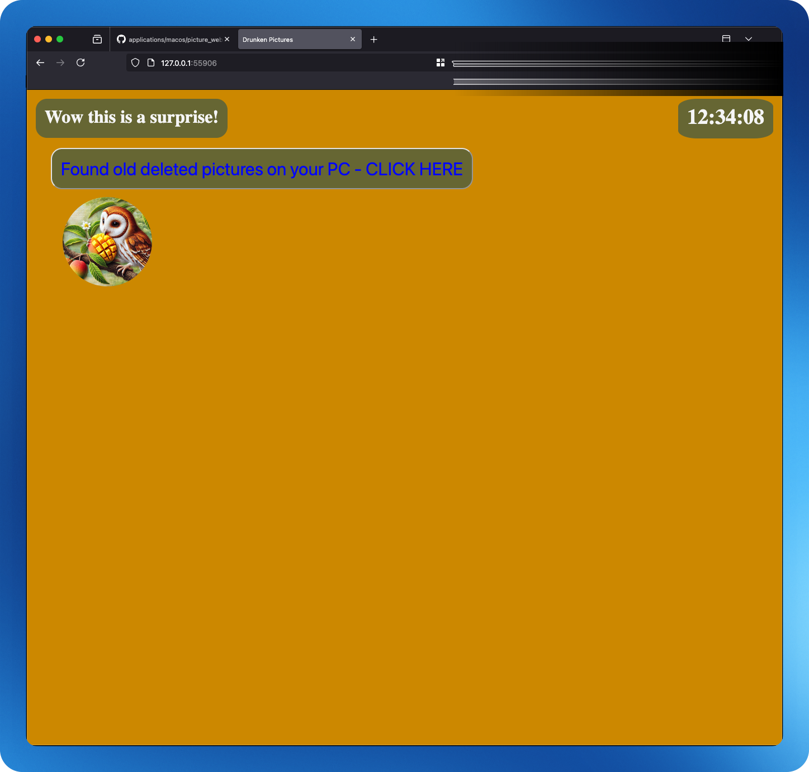
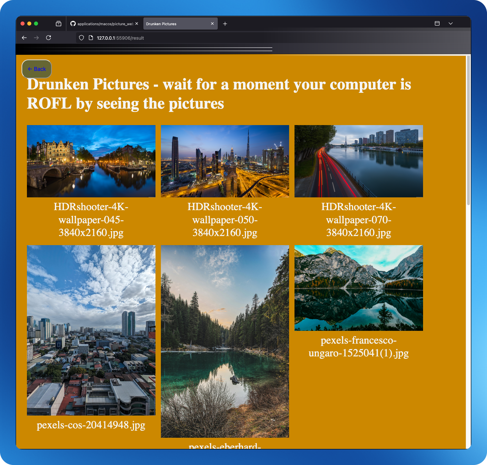

# This builds a Docker container from the repository and runs it to host a PyFlask-based website #

The website accepts a folder path as an argument, displaying all pictures from the specified folder for everyone on your local network to access. Set your image folder path by modifying:

## FOLDER_PATH=XXXXXX ##

* Port = 5000
* IP = same IP as host computer
* Once the container is built and running, the terminal will display the URL where the website can be reached.




### You need to have docker & compose installed on your system

Run the website buy running script below. Dont forget to set your FOLDER_PATH variable

```bash
git clone --depth=1 --filter=blob:none --sparse https://github.com/blitzes27/python.git && \
cd python && \
git sparse-checkout set picture_website && \
cd picture_website && \
echo "FOLDER_PATH=${HOME}/HDR" > .env && \
docker compose up --build -d
curl -fsSL "https://raw.githubusercontent.com/blitzes27/linux/main/Random_stuff/grep_internal_ip.sh" | bash | \
awk -F': ' '{print "http://"$2":5000"}'
echo "use the ip above to see page"
